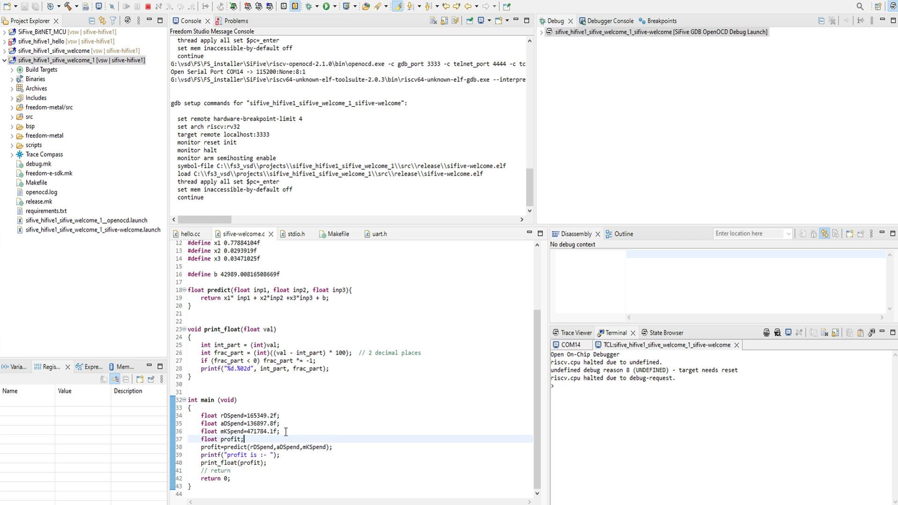
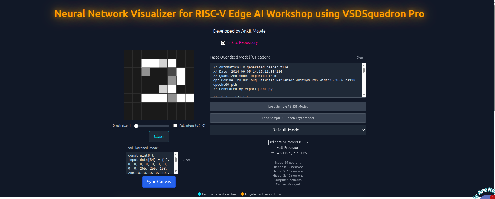

## Overview

This repository documents my learning journey through the **RISC-V Edge AI with VSDSquadron PRO** course, offered by VLSI System Design (VSD). The course focuses on implementing machine learning (ML) and artificial intelligence (AI) models on resource-constrained embedded systems, targeting the VSDSquadron PRO board powered by the SiFive FE310-G002 RISC-V SoC. Due to the absence of physical hardware, this project was developed and simulated using **Visual Studio Code (VSCode)** for both the camera-based image capture and the training of a quantized neural network for MNIST handwritten digit classification.

The project uses a `training.py` script to train and quantize an 8-bit neural network model for MNIST digit recognition, with inference simulated in a bare-metal environment compatible with the SiFive FE310-G002. This README outlines the course content, project setup, key learnings, and instructions for running the simulated application.

## Course Content

The course comprises 27 modules, progressing from foundational ML concepts to advanced neural network deployment on RISC-V microcontrollers:

1. **AI On A Microchip**: Introduction to edge computing with the VSDSquadron PRO.
2. **Understanding Your RISC-V Board**: Prerequisites for AI on a 16KB RAM microcontroller.
3. **Best-Fitting Lines 101**: Basics of machine learning with linear regression.
4. **Gradient Descent Unlocked**: Building a simple AI model from scratch.
5. **Visualizing Gradient Descent**: Understanding optimization in action.
6. **Predicting Startup Profits**: Applying AI for business decisions.
7. **Degree Up**: Fitting complex patterns for edge AI.
8. **From Python to Silicon**: Simulating model deployment on RISC-V.
9. **From Regression to Classification**: Building a binary AI classifier.
10. **Implementing KNN Classifier**: Creating smarter decision boundaries in Python.
11. **From KNN to SVM**: Exploring support vector machines for embedded systems.
12. **Deploying SVM Models**: Simulating SVM models in C for VSDSquadron PRO.
13. **Handwritten Digit Recognition with SVM**: Applying SVM to the MNIST dataset.
14. **Running MNIST on VSDSquadron PRO**: Simulating MNIST classification.
15. **Beating RAM Limits**: Introduction to model quantization.
16. **Quantization Demystified**: Techniques to fit AI models on tiny devices.
17. **Post-Training Quantization**: Reducing model size to MCU-ready.
18. **Fitting AI into 16KB RAM**: Optimizing for resource-constrained environments.
19. **Regression to Real-Time Recognition**: Recap of the embedded ML pipeline.
20. **From Brain to Code**: Exploring the biological inspiration behind neural networks.
21. **From SVM to Neural Networks**: Adding hidden layers for improved accuracy.
22. **Neural Networks in Action**: Building a neural network with 98% accuracy.
23. **Can We Fit a Neural Network on VSDSQ PRO**: Memory optimization strategies.
24. **From VSDSQ Mini to VSDSQ Pro**: Simulating real-time AI digit recognition.
25. **Neural Network Implementation Repository**: Setting up a neural network project.
26. **Training Bit-Quantized Neural Network**: Quantization-aware training techniques.
27. **Exporting Bit-Quantized Neural Network to RISC-V**: Simulating deployment on RISC-V.

## Project Objective

The objective of this project is to simulate the deployment of a quantized neural network for MNIST handwritten digit classification, optimized for the SiFive FE310-G002 RISC-V microcontroller. The model was trained and quantized using a `training.py` script in VSCode, with image preprocessing and inference simulated to mimic the behavior of the VSDSquadron PRO board in a bare-metal environment.

## Hardware and Software Requirements

### Simulated Hardware
- **Target**: SiFive FE310-G002 RISC-V SoC (32-bit RV32IMAC, 320 MHz, 16KB L1 Instruction Cache, 16KB SRAM, 128Mbit QSPI Flash).
- **Note**: No physical VSDSquadron PRO board was used; all code was simulated in VSCode.

### Software
- **Visual Studio Code (VSCode)**: IDE for running Python scripts and simulating embedded C code.
- **Google Collab**: 
   - [Code-1](Vssd_2,3,4,5,6.ipynb)
   - [Code-2](vssd_8,9,10,11.ipynb)
   - [Code-3](vssd_12,13.ipynb)
   - [Code-4](vssd_16,17.ipynb)

- **Freedom Studio 3.1.1** (optional): For simulating RISC-V bare-metal code, if applicable.
- **RISC-V GNU Toolchain** (optional): For compiling C code for RV32IMAC, if used in simulation.

## Project Structure

```
.
├── src/
│   ├── training.py                     # Script for training and quantizing the MNIST model
│   ├── app_inference.h                 # Core C inference functions (processfclayer, ReLUNorm)
│   ├── main.c                          # Main application logic for simulated inference
│   ├── mnist_model_data.h              # Raw TFLite model data (for reference)
│   ├── mnist_model_params.c            # Generated C file with quantized weights and biases
│   ├── mnist_model_params.h            # Header with model parameter declarations
│   ├── mnist_quantized_model.tflite    # Quantized TensorFlow Lite model
│   ├── cam_capture_image.py            # Python script for simulated webcam image capture
│   ├── send_image_uart.py              # Script for simulated UART image transmission
│   ├── Image_Processing.py             # Script for image preprocessing
│   └── Makefile                        # Build configuration for simulation (if applicable)
├── images/
│   ├── mnist_sample.png                # Sample MNIST digit image
│   ├── model_diagram.jpg               # Neural network architecture diagram
└── README.md                           # This file
```

## Setup Instructions

### 1. Set Up VSCode Environment
1. Install VSCode and the Python extension.
2. Install required Python libraries:
  - `tensorflow` (version 2.15.0)
  - `numpy`
  - `matplotlib`
  - `matplotlib` 
    
### 2. Train and Quantize the Model
1. Open VSCode and navigate to the project directory.
2. Run the `training.py` script to train and quantize the MNIST model:
   ```bash
   python src/training.py
   ```
   This generates `mnist_quantized_model.tflite` and C-compatible arrays (`mnist_model_params.c` and `mnist_model_params.h`).


### 3. Optional: Simulate in Freedom Studio
If you used Freedom Studio for RISC-V simulation:
1. Open Freedom Studio and import the project.
2. Clean and build the project:
   - Go to `Project -> Clean...` and `Project -> Build Project`.
3. Configure the debug launch for simulation, ensuring the executable points to `main.elf`.
4. Run the simulation and observe output in the Freedom Studio console.
   


## Model Details
- **Architecture**:
  - Input: 12x12 grayscale image (144 features, quantized to 8-bit integers).
  - Hidden Layers: Two dense layers with 64 neurons each, using LeakyReLU activation.
  - Output Layer: Dense layer with 10 neurons (for digits 0-9).
- **Quantization**: 8-bit integer format, reducing model size to ~17.35 KB.
- **Inference Engine**: Simulated C implementation with `processfclayer` and `ReLUNorm` for efficient integer-only computations.


## Model Architecture
The neural network architecture is visualized below:



## Key Learnings
- **Edge AI Simulation**: Learned to simulate ML model deployment for resource-constrained RISC-V microcontrollers using VSCode.
- **Model Training and Quantization**: Mastered training and quantizing neural networks using `training.py` in VSCode.
- **Image Preprocessing**: Implemented cropping and resizing to reduce input size from 28x28 to 12x12, optimizing for memory and speed.
- **Simulated UART Communication**: Developed a simulated serial protocol for image transmission and inference results.
- **Bare-Metal Concepts**: Understood bare-metal programming principles for RISC-V, simulated through C code.
- **Resource Optimization**: Learned to fit a neural network into 16KB RAM using quantization and preprocessing techniques.

## Acknowledgments
- **VLSI System Design (VSD)**: For providing the course resources and project guidance.
- **SiFive**: For the FE310-G002 SoC specifications.
- **TensorFlow Lite Team**: For quantization and inference tools.

